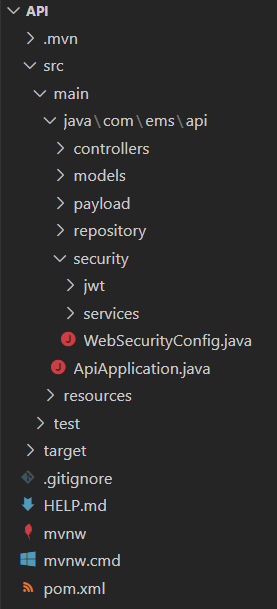

# EMS Application

The EMS Application is a Hospital Management System developed as a part of our training project at Mphasis.

# Folder Structure

There are 2 folders in the application. 
**ems** - This holds all the Frontend for the application. 
**api** - This holds all the backend code for the application.

## ems Folder Structure

## api Folder Structure

# Application Frontend
 

  
  

 
The frontend of the application was built purely on AngularJS with the Material UI library for Angular. You can register/login, create and view doctors and their departments, create and view appointments.

# Application Backend
 

  
  
  

 
The backend of the application was built on Spring Boot with MySQL for DB Connection. Changing the datasource URL and adding the Oracle dependency and dialect will make it functional with an OracleDB.

# Configurations
### Here's a list of steps to be done to get the application running.
### 1) Open <u>application.properties</u> in the api and change the configurations to your database and make the necessary changes if not using MySQL into the <u>pom.xml</u>.
### 2) To install angular make sure you've install NodeJS and open your terminal and enter the following command. 
### `npm i -g @angular/cli`
### 3) To install Material UI, open the <u>ems</u> project folder and run the following command. 
### `ng add @angular/material`
### 4) To run the frontend open the <u>ems</u> folder and run the following command in the terminal. 
### `ng s` or `ng serve`
### 5) To run the backend open the <u> api </u> folder in your terminal and run the following command. 
### `mvn spring-boot:run`
Make sure that you have Maven installed to run the spring-boot project.
